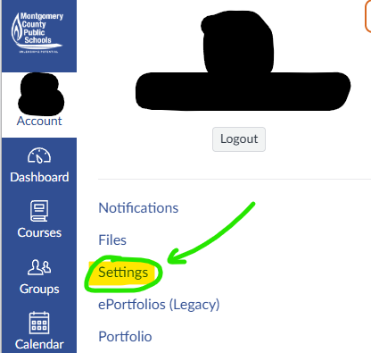
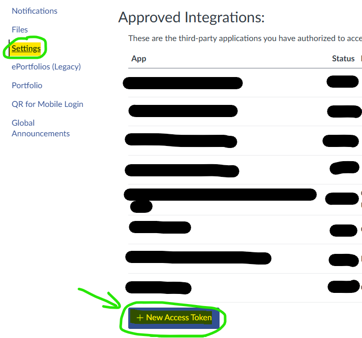
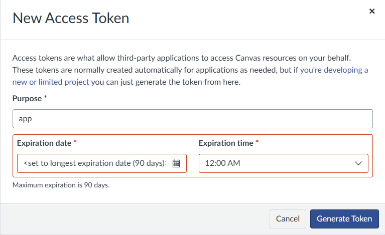
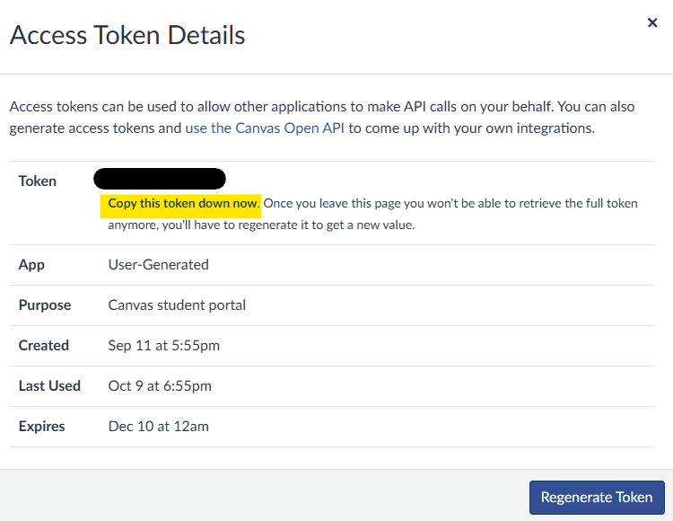

# Better Canvas

A personal, read-only companion for MCPS Canvas assignments and StudentVUE grades. React + TypeScript + Vite frontend, Fastify backend, and an installable PWA. Both parts deploy together as one Render web service.

## Set up your own copy (no downloads or installs)

Better Canvas is for **MCPS students only**. There is no shared Better Canvas website to sign up for. **Each student runs their own private copy** on a free hosting account, so your Canvas key and StudentVUE password stay in your account and nobody else ever sees them. Everything happens in a web browser, so it works on a Chromebook or school laptop.

> [!IMPORTANT]
> **You must do two things yourself. Nobody can do them for you:**
>
> 1. **Generate your own Canvas API key** from your own MCPS Canvas account (Step 1).
> 2. **Enter your own environment variables** (your settings, like the key and your site password) in your hosting account (Step 3).
>
> If either is missing, your site will not show your assignments. It will only show sample data, or refuse to start.

**You need:** about 10 minutes, a free [Render](https://render.com) account, and your MCPS Canvas login.

### Step 1: Generate your Canvas API key

A Canvas API key (Canvas calls it an "access token") is like a library card that lets your Better Canvas site read your own assignments. It can only read; it cannot submit or change anything.

1. Sign in to [MCPS Canvas](https://mcpsmd.instructure.com) in your browser.
2. Click **Account** (your profile picture, top left), then **Settings**.

   

3. Scroll down to **Approved Integrations** and click **+ New Access Token** at the bottom of the list.

   

4. For **Purpose**, type `Better Canvas`. For **Expiration date**, pick the latest date allowed. **MCPS keys last at most 90 days**, so you will need to make a new one about every three months (see "When your Canvas key expires" below).
5. Click **Generate Token**.

   

6. **Copy the key right away and keep it somewhere private.** Canvas says "Copy this token down now": once you close this window you can never see it again. If you lose it, click **Regenerate Token** (or delete it and make a new one).

   

**Never share your key or paste it into a chat, a message, GitHub, or anywhere except your own Render settings.** Anyone with it can read your Canvas.

### Step 2: Start the deploy

Click this button and sign in to Render (or create a free account):

[](https://render.com/deploy?repo=https://github.com/ewith20es/bettercanvas)

Render reads this project's `render.yaml` file and prepares a new web service in **your** Render account.

### Step 3: Enter your environment variables

Environment variables are your site's private settings. Render will ask you for the two marked **You enter**. Fill in both before you click deploy.

| Variable | Who fills it in | What to put |
| --- | --- | --- |
| `CANVAS_ACCESS_TOKEN` | **You enter** | The Canvas key you copied in Step 1. |
| `APP_PASSWORD` | **You enter** | A password you make up for **your Better Canvas site**, at least 8 characters. Do **not** reuse your Canvas, Google, or school password. |
| `APP_SECRET` | Filled in for you | Render generates a random value. Leave it. |
| `CANVAS_BASE_URL` | Filled in for you | `https://mcpsmd.instructure.com`. Do not change it. |
| `STUDENTVUE_PROXY_PROVIDER` | Filled in for you | `mobile` (signs in to StudentVUE directly with MCPS). |
| `NODE_ENV`, `NODE_VERSION` | Filled in for you | Leave as they are. |

You can change any of these later in Render: open your service, then **Environment**, edit the value, and choose **Save and deploy**.

### Step 4: Deploy and sign in

1. Click **Deploy** (Render may call it **Apply**) and wait for the first build to finish. It takes a few minutes.
2. Open the web address Render shows, something like `https://bettercanvas-xxxx.onrender.com`.
3. Sign in with your `APP_PASSWORD`.
4. Open **Courses** and pick each class's **period** so your classes list in your schedule order. If a Canvas course or section name already says the period (like "Period 3"), it is filled in for you. Canvas has no real class schedule, so the rest you set once yourself. Your choices are saved in that browser.
5. **Optional, for grades:** open **Gradebook** and sign in with your MCPS student ID and StudentVUE password. The Gradebook gets your periods, rooms and bell schedule from StudentVUE automatically.
6. **Optional, on your phone:** open your site and use **Share → Add to Home Screen** (iPhone) or **Install app** (Android/Chrome).

### Good to know

- **Your site shows "demo" or sample data?** `CANVAS_ACCESS_TOKEN` is missing or wrong. Check Step 3.
- **Your site will not start?** `APP_PASSWORD` is probably missing or shorter than 8 characters.
- **First load is slow sometimes.** Render's free plan puts your site to sleep after a while without visitors. The next visit can take up to about a minute while it wakes.
- **When your Canvas key expires,** make a new one (Step 1), then replace `CANVAS_ACCESS_TOKEN` in Render → **Environment** and choose **Save and deploy**.
- **Getting updates:** if you want new versions later, first click **Fork** at the top of this GitHub page (needs a free GitHub account), then deploy from your fork instead. Later, click **Sync fork** on your copy and Render rebuilds automatically.
- **Keep your site address and `APP_PASSWORD` to yourself.** Anyone with both can see your assignments.

If something goes wrong, ask in the [support Discord](https://discord.gg/e7Cwd6YWHU).

The sections below are for developers who want to run or change the code on their own computer.

## Try it locally

Use Node 24 LTS (22.12 or newer also supported).

```sh
npm ci --include=dev
npm run dev
```

Open **http://127.0.0.1:5173**. Without a Canvas token, the app uses clearly labeled sample assignments. No account or credential is needed to explore demo mode.

If a build reports that `tsc` is not recognized, run `npm install --include=dev` and retry `npm run build`. TypeScript and Vite are development dependencies, but they are required to build the app, including on Render.

## Connect your own Canvas account

1. If MCPS permits it, generate a personal token in your Canvas account settings. Do not send it through chat.
2. Copy `.env.example` to `.env` in the repository root.
3. Set `CANVAS_ACCESS_TOKEN` and `APP_PASSWORD`. The app passphrase must be at least 8 characters and must be different from your Canvas password. Prefer a long randomly generated passphrase saved in your password manager.
4. Restart the app and sign in using the app passphrase.

The app never requests or stores your Canvas password. If a token is configured without a sufficiently long app passphrase, the backend refuses to start. The exact Canvas origin is restricted to `https://mcpsmd.instructure.com`.

MCPS token permission and actual account responses still need to be verified using your own account. Generic Canvas API support does not guarantee a school permits personal tokens.

### Canvas key expiration reminder

The sidebar and Settings → Canvas connection show days until the date you enter.
The initial date is December 10, 2026 at 12 AM Eastern (the start of December 10).
Use **Key expiration date → Save date** after replacing a key. The reminder is
saved per account in the current browser; set it separately on each device. It
does not verify or extend the actual Canvas token expiration.

To replace the key, edit `CANVAS_ACCESS_TOKEN` in Render → Environment and choose
**Save and deploy**, then wait for the deployment to finish. Update the reminder
date in Better Canvas afterward. No frontend key or extra environment variable is needed.

## Connect StudentVUE / Synergy grades

The student-ID/password connection uses GradeDurian's proxy by default at `https://cloudproxy.gradedurian.workers.dev/fulfillAxios`, as requested October 4. Credentials pass through GradeDurian to MCPS. No new Render secret is needed. Old private relay settings are ignored unless you explicitly set `STUDENTVUE_PROXY_PROVIDER=private`; then configure `STUDENTVUE_RELAY_URL` and `STUDENTVUE_RELAY_TOKEN` using [Worker setup](workers/studentvue-relay/README.md). There is no automatic fallback between providers. A responding proxy does not guarantee successful MCPS authentication.

### Browser-session connection (beta)

For MCPS Google sign-in, the connection form also offers **Browser session (Google sign-in)**. Sign in to the official StudentVUE website yourself, then copy the **Cookie request header** from its `PXP2_Gradebook.aspx` request using your personal computer's browser Network tools. Paste it only into the masked field in your private Better Canvas app. Do not paste session cookies in chat, commits, logs, or public frontend configuration. This must be your own MCPS StudentVUE cookie, never a Google cookie.

This path reads the authenticated **PXP2 website**, not the rejected SOAP API. It uses the fixed MCPS origin and the website's read-only `Gradebook_SchoolClasses` / `Gradebook_ClassDetails` operations. Cookies are held in a separate server-memory jar for each signed-in Better Canvas session; returned cookies are updated, redirects are not followed, and cookies are never returned to frontend scripts or saved in the remembered-password cookie. No additional Render or Cloudflare variables are needed. Disconnect, app logout, a one-hour connection expiry, or a server restart clears the jar. An expired MCPS session requires copying a fresh cookie; this does **not** automate or renew Google sign-in. It also does not enable cookie copying on a managed device that restricts browser tools.

The beta parses course percentages, marks and assignment scores. Category totals/weights, the schedule countdown and grading-period dates are not supported in this mode. Unknown dates and scores remain unknown. Unsupported or changed portal markup produces an error and does not replace the previous snapshot with an empty or partial result. Only one school's gradebook is supported. Parser/transport/authentication tests use synthetic data; **live account compatibility has not yet been verified**.

Protocol references: the district's public [`PXP2_Gradebook.js`](https://md-mcps-psv.edupoint.com/js/PXP/PXP2_Gradebook.js), the older [Grade Melon backend](https://github.com/Jshap06/SynergyAltBackend) (cookie-based web access), and [Last Bell](https://github.com/noestudios/lastbell) (PXP2 fragment field descriptions). No third-party proxy is used by this connection.

### Student-ID/password connection

To connect using the selected StudentVUE provider:

1. Set `APP_PASSWORD` to at least 8 characters and restart the server. This protects the connection even if you are using Canvas demo mode.
2. Sign in to Better Canvas, open **Gradebook**, and enter your MCPS student ID and StudentVUE password directly in the app. Do not send credentials in chat or commit them to GitHub.
3. Choose a grading period and select a course to see its reported grade, categories, assignments, points, and teacher notes. Courses appear in StudentVUE period order. Use **Refresh grades** to check again.

All gradebook data comes from **StudentVUE / Synergy**, never from Canvas. For the student-ID/password method, the backend builds the StudentVUE SOAP request for `https://md-mcps-psv.edupoint.com/Service/PXPCommunication.asmx` and sends it over HTTPS through GradeDurian (or your explicitly selected private Worker) to Synergy. StudentVUE credentials pass through your Render server and the selected proxy in transit. Canvas remains the source for the separate assignment/submission views.

The live connection, credentials and MCPS session token are held in server memory for **one hour**, scoped to your signed-in app session; a cleanup timer removes expired connections within 30 seconds. The token is used for grade requests and never returned to the browser. Disconnecting or signing out clears it and cancels pending requests.

**Keep me signed in** (on by default in the connect form) saves your StudentVUE sign-in so you do not retype it when you reopen the app, after the hour ends, or after Render restarts. The student ID and password are encrypted with AES-256-GCM using a server-only key and stored in an `HttpOnly`, `Secure`, `SameSite=Strict` cookie that is sent only to `/api/gradebook` and expires after 30 days. Page scripts cannot read it, and it is useless without a signed-in Better Canvas session. The app reconnects automatically on launch and renews the connection shortly before each hour ends. Disconnecting StudentVUE, signing out of Better Canvas, or StudentVUE rejecting the saved password deletes it. Untick the box to keep the old memory-only behavior.

The encryption key comes from `APP_SECRET` (32+ random characters; Render generates one from `render.yaml`; the older name `GRADEBOOK_SECRET` also works) or, if that is not set, from `APP_PASSWORD`. Changing either signs every device out of StudentVUE. Nothing is saved to a database, browser storage, service-worker cache, logs, or source code.

The page uses GradeDurian-inspired grade cards, progress bars, category breakdowns, and a what-if calculator. Reported grades are displayed unchanged. The calculator adds one hypothetical assignment to Synergy's category totals, renormalizes populated category weights, and labels the result as an **estimate**. It never changes StudentVUE and does not claim to calculate an official GPA or final grade. Unknown weights or totals disable the estimate; unknown scores are not treated as zero. Schools using standards-based gradebooks receive an unsupported-format message.

Use **Preview with sample grades** to explore without connecting. Samples are always labeled and are never substituted for a failed live request. Gradebook updates are manual, with a 20-second server cache to avoid duplicate requests; this page does not poll StudentVUE. On a failed update, the last successful grades remain with their timestamp and an error notice.

The mobile connection is tested with synthetic responses. On October 3, 2026, the official MCPS `AttemptLogin` endpoint returned HTTP 401 to an anonymous POST using the documented student request, confirming the endpoint is present. This does **not** verify a successful live student login; sign in with your own account in the app to confirm. Failed refreshes keep the last successful grades unless MCPS explicitly rejects the sign-in. The primary protocol and JSON-field reference is [gradebook-mcp's mobile client](https://github.com/songsterq/gradebook-mcp/tree/main/src/lib/parentvue); its published live verification was for another district's ParentVUE account, not MCPS StudentVUE.

References: [GradeDurian](https://github.com/btdpass/GradeDurian) (design reference), [studentvue.js](https://github.com/jshap06/studentvue.js/tree/unified) (protocol/field reference), [MCPS StudentVUE service description](https://md-mcps-psv.edupoint.com/Service/PXPCommunication.asmx?WSDL). The supplied [gradebook-api](https://github.com/team-llambda/gradebook-api) wraps a separate third-party service and is not a dependency. This implementation does not copy GradeDurian's source or assets.

## Deploy frontend and backend on Render

Push this repository to your GitHub repository, then connect it to a Render **Web Service**. The repository includes `render.yaml` for Blueprint setup, or use these manual settings:

| Setting           | Value                                   |
| ----------------- | --------------------------------------- |
| Language          | Node                                    |
| Branch            | main                                    |
| Region            | Virginia                                |
| Root directory    | Leave blank                             |
| Build command     | `npm ci --include=dev && npm run build` |
| Start command     | `npm start`                             |
| Health check path | `/api/health`                           |
| Compute           | Free for the prototype                  |

Set these in Render's Environment panel:

| Variable                 | Value                                                                                                                           |
| ------------------------ | ------------------------------------------------------------------------------------------------------------------------------- |
| `NODE_ENV`               | `production`                                                                                                                    |
| `NODE_VERSION`           | `24.18.0`                                                                                                                       |
| `CANVAS_BASE_URL`        | `https://mcpsmd.instructure.com`                                                                                                |
| `CANVAS_ACCESS_TOKEN`    | Your own Canvas token; enter directly in Render                                                                                 |
| `APP_PASSWORD`           | A separate strong app passphrase, at least 8 characters                                                                         |
| `APP_SECRET`             | Optional. 32+ random characters that sign app sessions and encrypt saved StudentVUE sign-ins, in addition to `APP_PASSWORD`.    |
| `STUDENTVUE_PROXY_PROVIDER` | `mobile` (set by `render.yaml`) signs in directly with MCPS. Other options: `gradedurian` (the code default when unset) or `private` for your Worker. |
| `STUDENTVUE_RELAY_URL` | Only for private mode: your HTTPS Worker URL ending in `/fulfillAxios`. |
| `STUDENTVUE_RELAY_TOKEN` | Only for private mode: the same private value as the Worker's `RELAY_TOKEN`. Never sent to GradeDurian. |
| `APP_ORIGIN`             | Optional for the default Render address; required for a custom domain. Use the exact HTTPS app origin without a trailing slash. |

The backend automatically uses `RENDER_EXTERNAL_URL` for the standard Render address and listens on Render's assigned `PORT`. It serves the React build and `/api` from the same origin. Do not prefix secrets with `VITE_`.

To first deploy a public demo, leave the Canvas token and app passphrase empty. **This only serves sample data.** Add both secrets together before switching to live Canvas data. Live mode is protected by the app passphrase on every assignment-data route.

The free service may sleep. The first visit can take longer while it wakes. Signing in keeps a device signed in for 30 days, renewed each day you open the app, and it survives sleeps and restarts: the session cookie carries its own HMAC-signed expiry instead of relying on server memory. Changing `APP_PASSWORD` or `APP_SECRET` signs every device out. Signing out takes effect immediately and deletes the cookie; the server's sign-out list is in memory, so a copied cookie would work again after a restart until it expires. The server's assignment snapshot is still in memory and reloads after a restart. This v1 uses one server instance. It does not need a cloud database or persistent disk.

## Features

- Home: missing/overdue/redo work first, followed by Today, Tomorrow, Later, and undated work.
- Assignments: search, course filter, All / Upcoming / Missing / Submitted / Graded / Hidden, plus a Needs work filter. Missing includes both Canvas-marked missing work and overdue unsubmitted assignments, with a red count badge when any remain. Hidden assignments and courses are excluded from the badge.
- Hide announcement-like assignments with the eye button. They turn gray until you leave the current page or assignment tab. Find and restore them under Hidden, with search, course/status filters, and sorting by due date, name, or course. Hiding is saved per account on this device and does not change Canvas.
- Calendar: assignment deadlines, month navigation, selected-day agenda, and undated work.
- Courses: show/hide courses, local nicknames and colors.
- Gradebook: StudentVUE connection, grading periods, schedule-ordered grade cards, course/category details, searchable and sortable assignment scores, and a what-if estimate for a new assignment.
- Settings: connection state, per-course update results, timezone, theme, optional offline data, installation instructions, clear data, and sign out.
- Assignment details: due/submitted times, grading, missing/late flags, points, availability, and the Canvas link.

Submission, grading, and deadline status are independent. A graded zero can still be missing. Overdue is calculated; Missing and Late come from Canvas. External-tool or absent submission data gets an explicit check/unavailable label. The app cannot submit work or mark something submitted.

## Offline behavior

The service worker caches only the app shell and static assets. Private API responses use `Cache-Control: no-store` and are excluded from service-worker caching. Turn on **Offline assignments** in Settings to save normalized assignment metadata in Dexie on a trusted device. Cached data is not encrypted and can be read by someone using that browser profile. No submission bodies, comments, attachments, or tokens are cached.

The app refreshes on launch, after reconnecting, on focus when older than five minutes, and every five minutes while visible. Data older than 15 minutes is marked stale. Course snapshots update only after all pages succeed; failed courses retain their old data and timestamp. A server restart can temporarily remove its in-memory snapshots; opted-in device caches remain available offline.

Offline mode cannot learn about new submissions or grades. Browser storage can be evicted. Sign-out requires a server connection, invalidates the session, and clears saved local data. Clearing local data does not revoke your Canvas token.

## Development and checks

```sh
npm run typecheck
npm test
npm run build
npm start
```

`npm start` serves the compiled app at http://127.0.0.1:3001 by default. To test that combined build locally, set `APP_ORIGIN=http://127.0.0.1:3001` in `.env` (restore port 5173 for `npm run dev`). Do not set `NODE_ENV=production` for this HTTP-only local preview; production requires an HTTPS origin.

The test suite covers status edge cases, timezones/DST, pagination, unsafe next links, expired tokens, retries, partial-course preservation, authentication, CSRF origin checks, session invalidation, and login rate limiting. Browser checks should cover all routes, assignment details, course visibility, narrow screens, theme changes, and offline reload of the built app.

Regenerate the committed PWA icons after changing the favicon with `node scripts/prepare-icons.mjs`.

## Structure

```text
apps/web/             React pages, styles, Dexie cache, Vite/PWA configuration
apps/server/src/      App authentication, Canvas sync, direct StudentVUE mobile client and website beta
packages/domain/src/ Shared data types, status rules, dates, synthetic demo data
tests/               Domain and backend regression tests
scripts/             PWA icon generation
docs/V1-PLAN.md       Original product and technical plan
render.yaml          Render deployment configuration
```

Dependencies are managed at the repository root; the small app does not need separate package installations. Uploads, messaging, notifications, multi-user OAuth, general school calendars, and syncing preferences across devices are outside v1.

API references: [Canvas assignments](https://developerdocs.instructure.com/services/canvas/resources/assignments), [submissions](https://developerdocs.instructure.com/services/canvas/resources/submissions), [pagination](https://developerdocs.instructure.com/services/canvas/basics/file.pagination), [authentication](https://developerdocs.instructure.com/services/canvas/oauth2/file.oauth).
